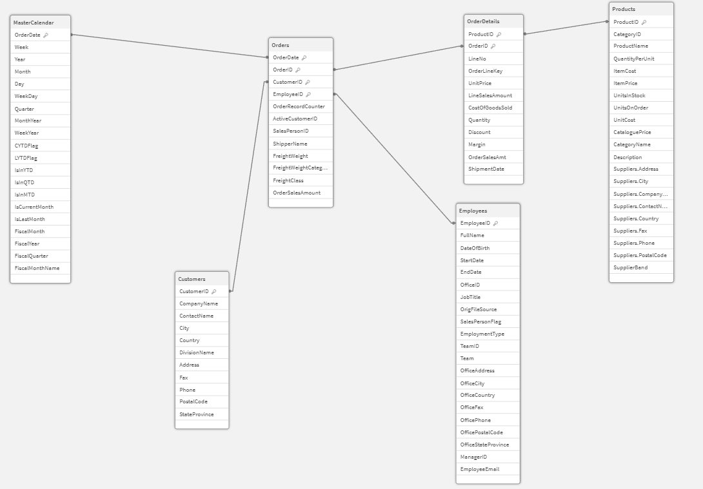

# Qlik Analytics Journey — Badge Qlik Cloud Analyze

Repositorio de práctica y documentación de mi recorrido hacia el badge **Qlik Cloud Analyze** (módulo *Data Modeling with Qlik Cloud Analytics*), dentro de la suscripción Qlik Student Learning.

## 🎯 Objetivo

Registrar el proceso de construcción de un modelo de datos en Qlik Sense: desde la carga y transformación de datos hasta la estructuración del modelo, documentando decisiones técnicas y avances por módulo.

## 🏗️ Arquitectura del modelo

El proyecto utiliza una arquitectura de datos basada en **3 capas QVD**:

- **Extract** → extracción de los datos desde las diferentes fuentes.
- **Transform** → limpieza, transformación y preparación de los datos.
- **Load / Analytics** → carga final y estructuración del modelo para el análisis.

### Evolución del modelo de datos

Durante el proceso de modelado se construyeron y evaluaron dos estructuras:

#### 1. Modelo inicial — Esquema en copo de nieve (Snowflake)

La primera versión del modelo organizaba las dimensiones de forma normalizada, dando lugar a un **esquema en copo de nieve**.


#### 2. Modelo optimizado — Esquema estrella (Star Schema)

Posteriormente, se revisó la estructura y se optimizó el modelo hacia un **esquema estrella**, simplificando las relaciones entre tablas y la estructura dimensional.



La evolución de **Snowflake → Star Schema** forma parte del proceso de aprendizaje y optimización del proyecto. El **modelo estrella constituye la estructura final** del modelo analítico.

## 🧭 Estructura del badge (5 módulos)

| # | Módulo | Estado |
|---|--------|--------|
| 1 | Cargando datos (conexión y carga) | ✅ Finalizado |
| 2 | Transformación de datos | ✅ Finalizado |
| 3 | Creando el master calendar | ✅ Finalizado |
| 4 | Estructuración del modelo | ✅ Finalizado |
| 5 | Finalización de los datos | ⏳ Pendiente |

### Módulo 1 — Cargando datos 

- **Desde base de datos (SQL Server, conexión `ABC`)**: tablas `Orders`, `OrderDetails` (sección `DB_Measures`) y `Customers`, `Divisions` (sección `DB_Dimensions`)
- **Desde Data Catalog**: archivo Excel (`Employees`), Excel multi-hoja (`Teams`), CSV (`Offices`), archivo de ancho fijo (`Org_structure`), inclusión de script externo `.qvs` (generación de emails)
- Uso de variables (`vFileLocation`, `vDBConn`) y *find & replace* para desacoplar rutas/conexiones del script

### Módulo 2 — Transformación de datos 

- **Objetivo**: Limpiar, validar y estructurar los datos mediante script de Qlik para asegurar la calidad de datos (*Data Quality*) y optimizar el rendimiento de la capa de análisis/modelado.
- **Técnicas y funciones aplicadas en Qlik Script**:
  - **Alias de datos**: Renombrado y estandarización de campos usando la cláusula `AS`.
  - **Estrategias de carga avanzadas**: Implementación de **Preceding Load** (cargas precedentes) para transformaciones en cascada y **Resident Load** para reutilizar tablas ya cargadas en memoria.
  - **Filtrado y segmentación**: Restricción de registros con cláusulas `WHERE` limitantes.
  - **Lógica condicional y flags**: Aplicación de sentencias `IF()` para derivar nuevos atributos y crear marcas/banderas (*flags*) de negocio.
  - **Generación de secuencia y datos**: Uso de funciones de generación de números aleatorios (`Rand()`) y procesamiento secuencial con contadores (`RecNo()`, `RowNo()`, `IterNo()`).

### Módulo 3 — Creando el master calendar

* **Interpretación y formato de fechas**: Diferenciación entre funciones de interpretación y formato para convertir correctamente datos temporales y controlar su representación.
* **Funciones de fecha y hora**: Manipulación de fechas mediante funciones para extraer y calcular atributos temporales como día, mes, año, semana y trimestre.
* **Master Calendar**: Diseño de una tabla calendario para generar atributos temporales y facilitar el análisis de los datos por diferentes periodos.
* **Banderas temporales**: Creación de *flags* para identificar dinámicamente periodos de análisis como **YTD** (*Year-to-Date*) y facilitar su uso en expresiones.
* **Análisis temporal**: Aplicación de la función **`InYearToDate()`** para identificar registros pertenecientes a periodos acumulados dentro del año.
* **Calendario fiscal**: Generación de atributos fiscales para adaptar el análisis temporal a periodos definidos por el negocio.

### Módulo 4 — Estructuración del modelo

- **Estructuración y optimización del modelo de datos**: análisis de la estructura del modelo para identificar y resolver problemas derivados de relaciones entre tablas y múltiples fuentes de datos.
- **Problemas de modelado**: comprensión y resolución de **referencias circulares** y **claves sintéticas**, así como de otros problemas derivados de asociaciones no deseadas entre tablas.
- **Alias de campos**: uso de alias para controlar las asociaciones entre tablas y evitar asociaciones incorrectas o ambiguas.
- **AutoNumber**: aplicación de `AutoNumber` para generar claves numéricas y reducir el consumo de memoria, mejorando la eficiencia del modelo.
- **Reducción del modelo de datos**: estudio de diferentes estrategias para transformar modelos complejos en estructuras más simples y eficientes.
- **Star Schema**: optimización del modelo desde un **esquema en copo de nieve (Snowflake)** hacia un **esquema estrella (Star Schema)**, reduciendo la complejidad de las relaciones y centralizando las asociaciones alrededor de la tabla de hechos.
- **Técnicas de optimización**: análisis del uso de **joins**, **concatenación** y **cargas de mapeo (Mapping Load)** como mecanismos para simplificar y optimizar el modelo de datos.

## 📂 Estructura del repositorio

```
/scripts            → scripts exportados del Data Load Editor (se irá actualizando sobre el mismo script)
/docs/screenshots    → capturas de apoyo (Data Model Viewer, debugger, etc.)
README.md
.gitignore
```

## 🛠️ Herramientas

Qlik Sense (Qlik Cloud), Git / GitHub, Git Bash

---
*Actualizado a medida que avanzo en cada módulo del learning path.*