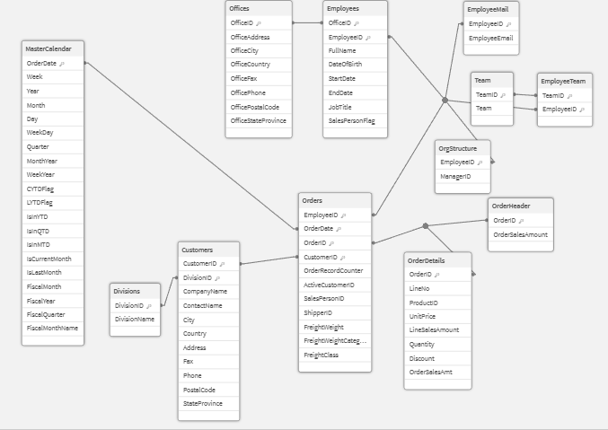

# Qlik Analytics Journey — Badge Qlik Cloud Analyze

Repositorio de práctica y documentación de mi recorrido hacia el badge **Qlik Cloud Analyze** (módulo *Data Modeling with Qlik Cloud Analytics*), dentro de la suscripción Qlik Student Learning.

## 🎯 Objetivo

Registrar el proceso de construcción de un modelo de datos en Qlik Sense: desde la carga de datos hasta un esquema en copo de nieve optimizado, documentando decisiones técnicas y avances por módulo.

## 🏗️ Arquitectura del modelo

- **3 capas QVD**: extracción → transformación → carga final (Extract / Transform / Load layers)
- **Esquema en copo de nieve (snowflake schema)** como resultado final del modelado
- Capturas de pantalla del Data Model Viewer y Debugger en `/docs/screenshots`

### Vista del Modelo de Datos Actual



## 🧭 Estructura del badge (5 módulos)

| # | Módulo | Estado |
|---|--------|--------|
| 1 | Cargando datos (conexión y carga) | ✅ Finalizado |
| 2 | Transformación de datos | ✅ Finalizado |
| 3 | Creando el master calendar | ✅ Finalizado |
| 4 | Estructuración del modelo | ⏳ Pendiente |
| 5 | Finalización de los datos | ⏳ Pendiente |

### Módulo 1 — Cargando datos 

- **Desde base de datos (SQL Server, conexión `ABC`)**: tablas `Orders`, `OrderDetails` (sección `DB_Measures`) y `Customers`, `Divisions` (sección `DB_Dimensions`)
- **Desde Data Catalog**: archivo Excel (`Employees`), Excel multi-hoja (`Teams`), CSV (`Offices`), archivo de ancho fijo (`Org_structure`), inclusión de script externo `.qvs` (generación de emails)
- Uso de variables (`vFileLocation`, `vDBConn`) y *find & replace* para desacoplar rutas/conexiones del script

### Módulo 2 — Transformación de datos 

- **Objetivo**: Limpiar, validar y estructurar los datos mediante script de Qlik para asegurar la calidad de datos (*Data Quality*) y optimizar el rendimiento de la capa de análisis/modelado.
- **Técnicas y funciones aplicadas en Qlik Script**:
  - **Alias de datos**: Renombrado y estandarización de campos usando la cláusula `AS`.
  - **Estrategias de carga avanzadas**: Implementación de **Preceding Load** (cargas precedentes) para transformaciones en cascada y **Resident Load** para reutilizar tablas ya cargadas en memoria.
  - **Filtrado y segmentación**: Restricción de registros con cláusulas `WHERE` limitantes.
  - **Lógica condicional y flags**: Aplicación de sentencias `IF()` para derivar nuevos atributos y crear marcas/banderas (*flags*) de negocio.
  - **Generación de secuencia y datos**: Uso de funciones de generación de números aleatorios (`Rand()`) y procesamiento secuencial con contadores (`RecNo()`, `RowNo()`, `IterNo()`).

### Módulo 3 — Creando el master calendar

* **Interpretación y formato de fechas**: Diferenciación entre funciones de interpretación y formato para convertir correctamente datos temporales y controlar su representación.
* **Funciones de fecha y hora**: Manipulación de fechas mediante funciones para extraer y calcular atributos temporales como día, mes, año, semana y trimestre.
* **Master Calendar**: Diseño de una tabla calendario para generar atributos temporales y facilitar el análisis de los datos por diferentes periodos.
* **Banderas temporales**: Creación de *flags* para identificar dinámicamente periodos de análisis como **YTD** (*Year-to-Date*) y facilitar su uso en expresiones.
* **Análisis temporal**: Aplicación de la función **`InYearToDate()`** para identificar registros pertenecientes a periodos acumulados dentro del año.
* **Calendario fiscal**: Generación de atributos fiscales para adaptar el análisis temporal a periodos definidos por el negocio.


## 📂 Estructura del repositorio

```
/scripts            → scripts exportados del Data Load Editor (se irá actualizando sobre el mismo script)
/docs/screenshots    → capturas de apoyo (Data Model Viewer, debugger, etc.)
README.md
.gitignore
```

## 🛠️ Herramientas

Qlik Sense (Qlik Cloud), Git / GitHub, Git Bash

---
*Actualizado a medida que avanzo en cada módulo del learning path.*